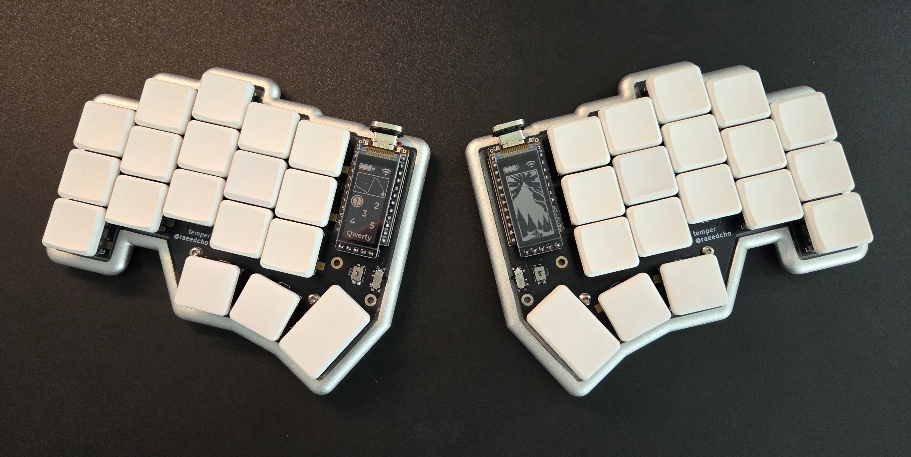
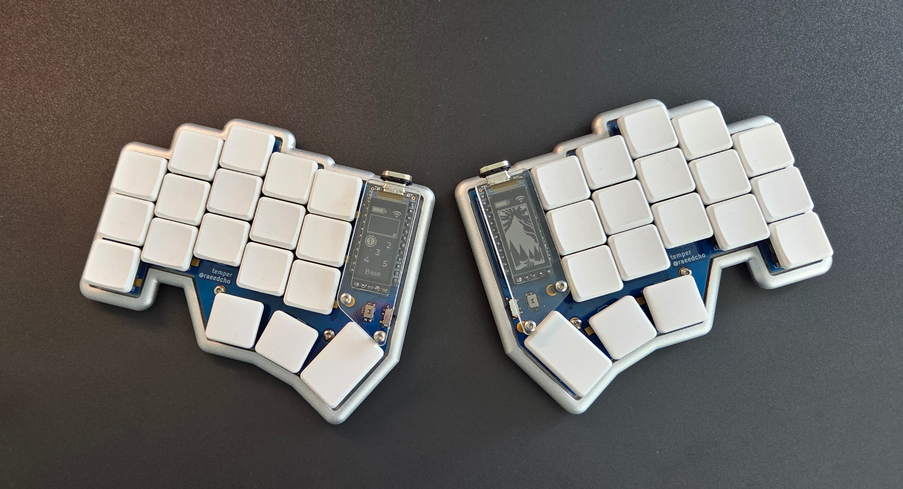
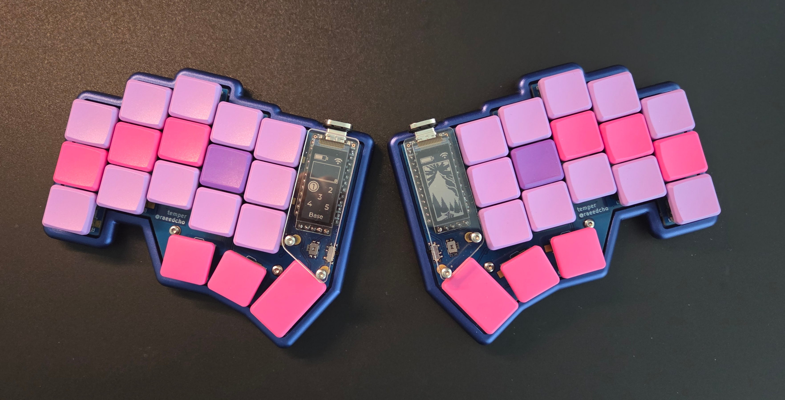

Ækeynox with Ergo-l emulation for azerty Windows for Temper Keyboard
====================================================================================================
This is a [Ækeynox](https://github.com/OneDeadKey/zmk-config-aekeynox) branch for the [Temper](https://github.com/raeedcho/temper) Keyboard.
It keeps the standard Ækeynox implementation on the base layer, but add an [Ergo-l](https://ergol.org/) emulation for Azerty Windows computer, in HRM non VI mode.

You can toggle between standard and emulation by pressing Function+shift+v (the 'v' key in ergol layout)

The Ergol-l layout is not totally implemented, but there are as much complete layers I succeeded to emul:
base, 1dk, navnum, numlock, sym, caplock and their shifted version.

I have added a custom function layer and a custom BT layer, so function layer is not totally identical to default selenium implementation.

Some pictures of the tempers I built, with [anodized aluminum case](https://github.com/CoenTurk/temper-metal) from [CoenTurk](https://github.com/CoenTurk):

